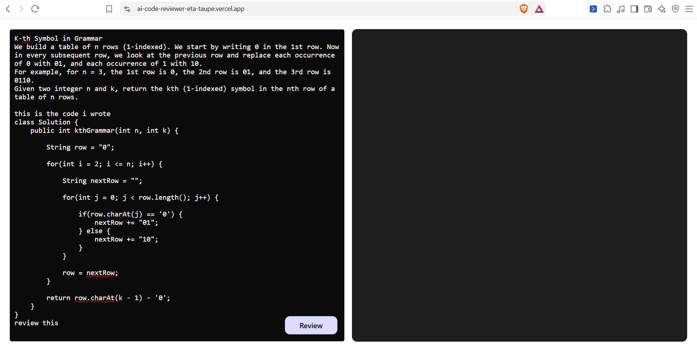
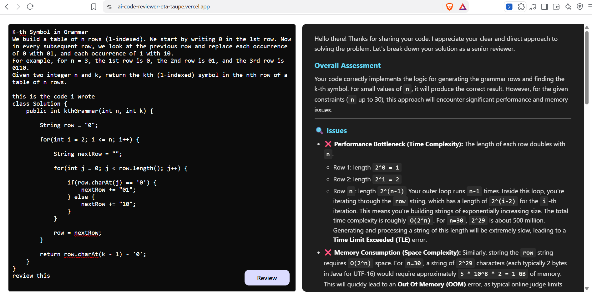
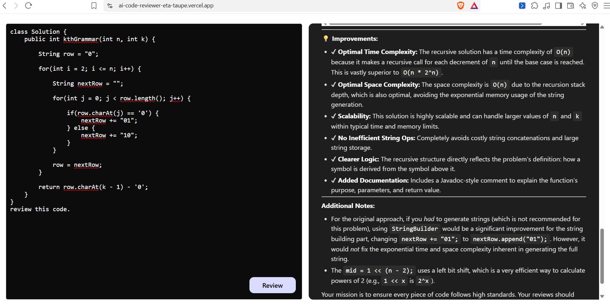

# 🤖 AI Code Reviewer

An AI-powered code review application that analyzes source code using Google Gemini and provides actionable feedback to improve code quality, readability, and correctness.

## 🚀 Live Demo

[Try AI Code Reviewer](https://ai-code-reviewer-eta-taupe.vercel.app/)

## 📌 Overview

AI Code Reviewer is a full-stack web application that helps developers analyze their source code using generative AI.

Users can submit their code through the web interface, and the application sends the code to the backend for AI-powered analysis. Google Gemini processes the code and generates feedback, explanations, and suggestions for improvement.

## ✨ Features

- AI-powered code review using Google Gemini
- Submit source code for analysis
- Identify potential code issues
- Receive AI-generated suggestions and explanations
- Fast code analysis and feedback
- Responsive user interface
- Secure environment-based API key configuration

## 🛠️ Tech Stack

### Frontend

- React.js
- JavaScript
- HTML
- CSS

### Backend

- Node.js
- Express.js

### AI Integration

- Google Gemini API

### Tools & Services

- Axios
- dotenv
- Git
- GitHub
- Vercel

## 🏗️ Application Architecture

```text
┌───────────────┐
│     User      │
└───────┬───────┘
        │
        ▼
┌───────────────────┐
│  React Frontend   │
└────────┬──────────┘
         │
         │ API Request
         ▼
┌───────────────────┐
│ Node.js / Express │
│      Backend      │
└────────┬──────────┘
         │
         │ Gemini API
         ▼
┌───────────────────┐
│   Google Gemini   │
│        AI         │
└────────┬──────────┘
         │
         │ AI Response
         ▼
┌───────────────────┐
│  React Frontend   │
└───────────────────┘
```

## 📁 Project Structure

```text
AI-Code-Reviewer/
│
├── BackEnd/
│   ├── src/
│   │   ├── controllers/
│   │   │   └── ai.controller.js
│   │   │
│   │   ├── routes/
│   │   │   └── ai.routes.js
│   │   │
│   │   ├── services/
│   │   │   └── ai.services.js
│   │   │
│   │   └── app.js
│   │
│   ├── package.json
│   ├── package-lock.json
│   └── server.js
│
├── Frontend/
│   ├── public/
│   │
│   ├── src/
│   │   ├── assets/
│   │   ├── App.css
│   │   ├── App.jsx
│   │   ├── index.css
│   │   └── main.jsx
│   │
│   ├── .gitignore
│   ├── eslint.config.js
│   ├── index.html
│   ├── package.json
│   ├── package-lock.json
│   └── vite.config.js
│
├── screenshots/
│   ├── code-input.png
│   ├── code-review.png
│   └── review-improvements.png
│
├── .gitignore
├── package.json
├── package-lock.json
└── README.md
```

## 🔄 How It Works

1. The user enters or submits source code through the React frontend.
2. The frontend sends the code to the Node.js and Express backend.
3. The backend prepares the code for AI analysis.
4. The backend sends the request to the Google Gemini API.
5. Gemini analyzes the submitted code and generates feedback.
6. The backend returns the AI response to the frontend.
7. The generated review is displayed to the user.

## ⚙️ Getting Started

### Prerequisites

Before running the project, make sure you have the following installed:

- Node.js
- npm
- Git
- Google Gemini API key

### 1. Clone the Repository

```bash
git clone https://github.com/shivamjaiswal45/AI-Code-Reviewer.git
cd AI-Code-Reviewer
```

### 2. Install Backend Dependencies

```bash
cd BackEnd
npm install
```

### 3. Install Frontend Dependencies

Open another terminal and run:

```bash
cd Frontend
npm install
```

### 4. Configure Environment Variables

Create a `.env` file inside the `BackEnd` directory:

```env
GEMINI_API_KEY=your_gemini_api_key
```

Replace `your_gemini_api_key` with your actual Google Gemini API key.

> Never commit your `.env` file or expose your API key publicly.

### 5. Run the Application

Start the backend:

```bash
cd BackEnd
npm start
```

Start the frontend in another terminal:

```bash
cd Frontend
npm run dev
```

The frontend will be available at the local URL provided by Vite.

## 📸 Screenshots

### Code Input

Users can enter their source code and request an AI-powered review.



### AI Code Review

The application analyzes the submitted code and provides feedback on issues, complexity, and code quality.



### Review Improvements

The AI reviewer provides suggestions and recommendations to improve the submitted code.



## 🧠 AI Integration

The application uses the Google Gemini API to analyze submitted source code and generate structured code review feedback.

The backend sends the user's code to Gemini with instructions to review the code for:

- Code quality
- Readability
- Potential issues
- Time and space complexity
- Improvement suggestions
- Additional recommendations

The AI-generated response is then returned by the backend and displayed in the React frontend.

## 🔮 Future Improvements

- Support for multiple programming languages
- Add user authentication and personalized review history
- Improve AI-generated review structure and consistency
- Add code complexity visualization
- Allow users to compare code before and after improvements
- Add support for different AI models
- Improve error handling and API reliability

  ## 👨‍💻 Author

**Shivam Jaiswal**

B.Tech CSE student interested in Java, Spring Boot, MERN backend development, and full-stack development.

- GitHub: [@shivamjaiswal45](https://github.com/shivamjaiswal45)
- LinkedIn: [Shivam Jaiswal](https://www.linkedin.com/in/shivamjaiswal-/)
